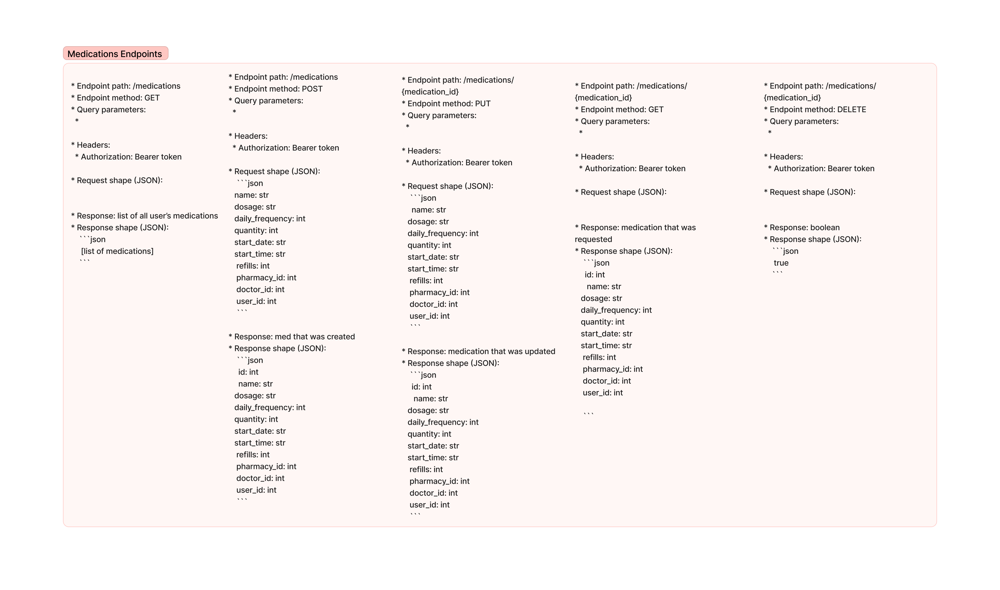
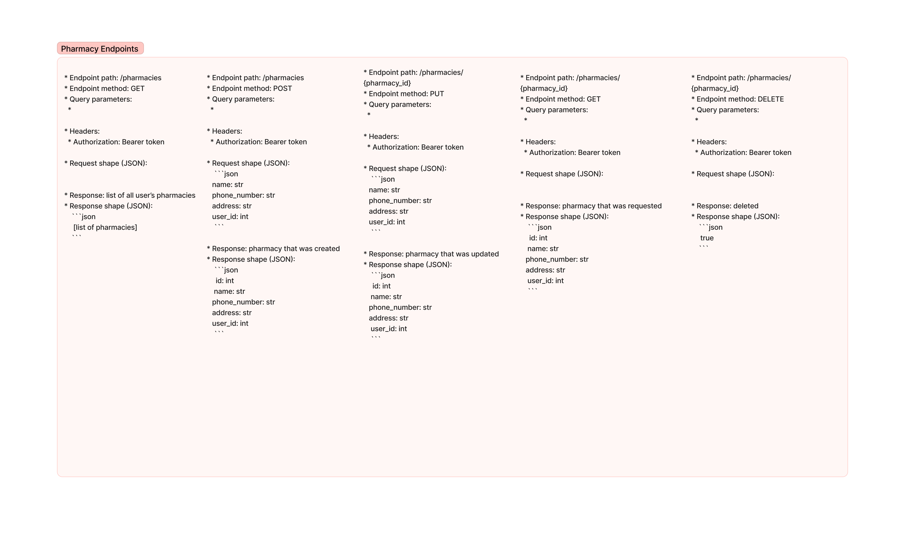
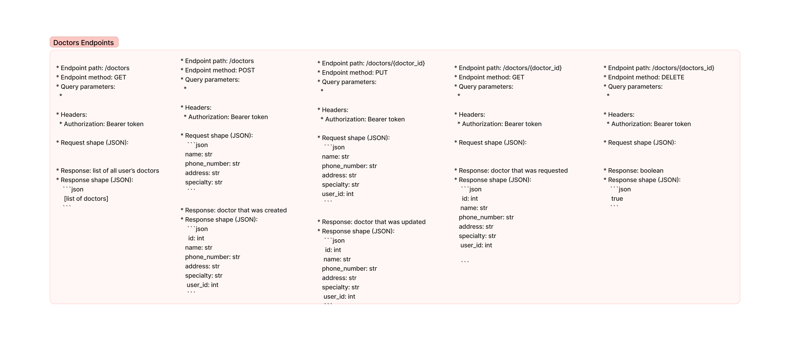
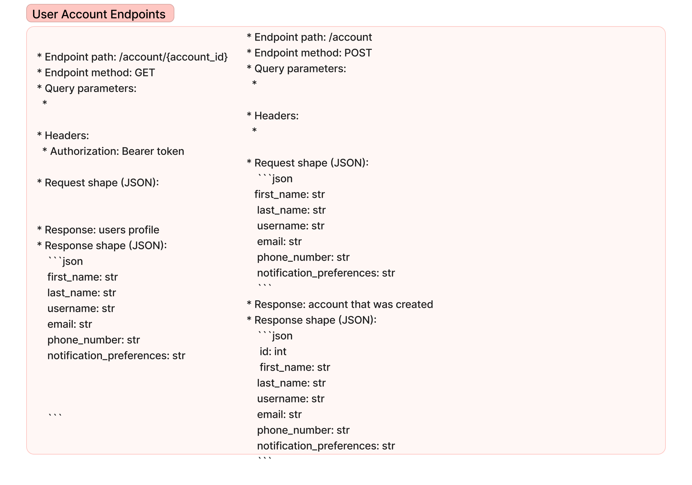
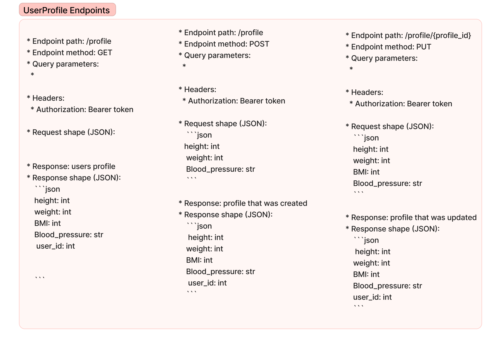

# PROJECT: Medication Reminder

Project Medication Reminder is an application that allows users to manage and track their medication schedules.

The project is a full stack FastAPI, PostgreSQL and React application that is built to run on Docker.

## Team:

- Onkur Lal
- Michael Zinzun
- Dennie Chan

### Design Color Palette

Button Colors, Title Bar, (#164863)
Borders for forms and tables (#427D9D)
Active item (#9BBEC8)
Alternate background for table (#DDF2FD)
Background color (#FFFBF5)

### Database Models Design

The diagram below showcases the various database models utilized in our project and their relationship to one another.

### Backend API Endpoints

Here are diagrams of the API endpoints serving our project:

**Medications API**

**Pharmacy API**

**Doctors API**

**User Account API**

**User Profile API**

### Steps to Run the Project

1. Fork the project located at [Module3 Project Gamma](https://gitlab.com/Onkurlal/module3-project-gamma)
2. Once the project is forked, close via git clone https link.
3. Once cloned, cd into app directory and run the following commands:
4. - Make sure you have Docker running
5. docker volume create postgres-data
6. docker volume create pg-admin
7. docker-compose build
8. docker-compose up
