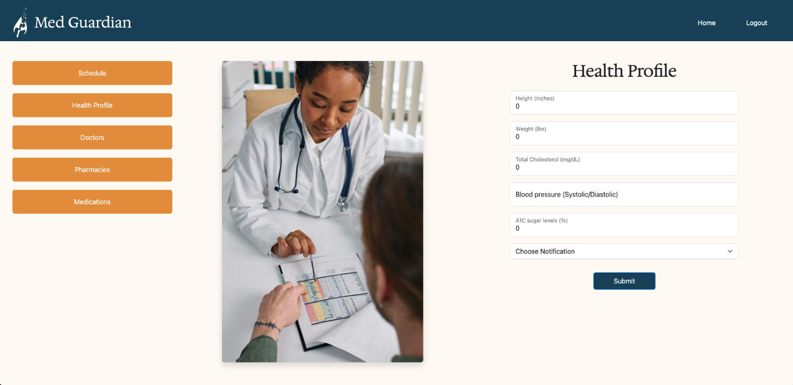
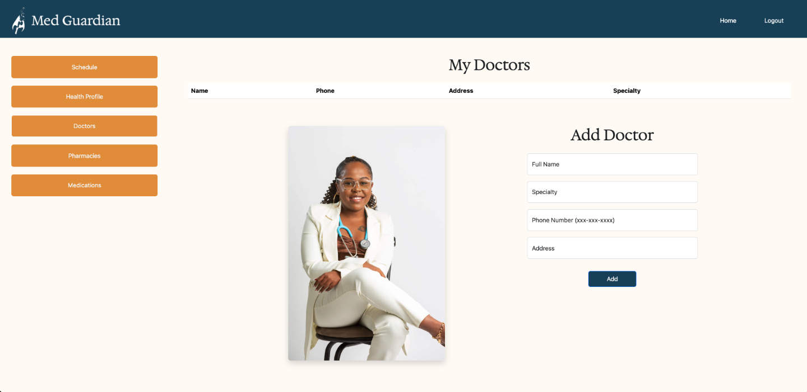

# PROJECT: Med Guardian

Empowering Health: Seamless Medication Management, Tracking, and Scheduling for Your Well-Being

The project is a full stack FastAPI, PostgreSQL and React application that is built to run on Docker.

## Team:

- Onkur Lal
- Michael Zinzun
- Dennie Chan

## Technologies used for Med Guardian

- FastApi
- PostgreSQL
- Docker
- React
- Redux

## Project Overview

<ins>Problem Statement</ins>: Many individuals face challenges in effectively managing, tracking, and scheduling their medication regimens, leading to potential health risks, missed doses, and overall suboptimal health outcomes. The complexity of medication schedules, diverse prescriptions, and the lack of user-friendly tools contribute to the struggle individuals experience in adhering to their prescribed medication plans. Additionally, the absence of a centralized platform for medication management poses a barrier to efficient communication between patients, healthcare providers, and caregivers.

<ins>Goals and Objectives</ins>: Our goal is to address these issues by developing a comprehensive medication management application that simplifies the process of managing, tracking, and scheduling medications. This application aims to provide users with an intuitive and accessible tool to enhance medication adherence, and improve health outcomes.

<ins>User Stories</ins>: We created several user personae to help visualize our users and the challenges and frustrations they might currently face managing their medication routines:

- Barbara, 56 years old, is a teacher who has several health issues and is taking 5 different medications and has trouble remembering to take them. She also forgets to refill her medications which has caused lapses in her health regiment as she waits to get them refilled.

- George, 28, is a busy working professional who is on cholesterol and diabetes medication and often forgets to take his medication and would like something to help remind him.

<ins>Development</ins>: The planning and development of Med Guardian was driven by Domain Driven Design. The types of data and information needed for the application was determined through an iterative process of brainstorming, diagramming and discussion which resulted in the following data models and relationships:

<ins>Design</ins>: The design and layout of the project was created through numerous sessions of design collaboration and discussions of user flow. Necessary elements, user interactions, theme, tone, colors, fonts and layouts were outlined iteratively from wireframes, rough drafts, higher fidelity mock-ups to completed designs.

### Design Color Palette

- Button Colors, Title Bar, (#164863)
- Button Color, Complimentary/Contrast (#e69937)
- Borders for forms and tables (#427D9D)
- Active item (#9BBEC8)
- Alternate background for table (#DDF2FD)
- Background color (#FFFBF5)

## Screenshots

### Home Page

### Register Page

### Login Page

### Health Profile

### Doctors

### Pharmacies

### Medications

### Calendar and Schedules

## Project Planning and Organization

For our project we utilized an issue and ticket system within the repo to help plan, organize and coordinate our efforts to develop the application. We utilized the following strategy to optimize and guide our efforts:

1. We began our day discussing our plans, any blockers we faced in the previous day and then assigned ourselves to tickets.
2. Each time member worked on feature branches associated with their tickets.
3. Whenever a team member was completed with their ticket they would request a peer review of their work.
4. After tickets were reviewed then that team member would submit their work for a merge request.
5. Each merge request was reviewed by a fellow team member and absent any issues or conflict with tests or linted would be submitted.
6. Most feature branches would be deleted upon merge or kept if further development was warranted.

Note: Some tickets were particularly complicated and would have several team members working on them.

[Link to issues, Project Tracking and Development Board](https://gitlab.com/Onkurlal/module3-project-gamma/-/boards)

### Backend API Endpoints

Here are diagrams of the API endpoints serving our project:

**Medications API**

**Pharmacy API**

**Doctors API**

**User Account API**

**User Profile API**

### Steps to Run the Project

1. Fork the project located at [Module3 Project Gamma](https://gitlab.com/Onkurlal/module3-project-gamma)
2. Once the project is forked, close via git clone https link.
3. Once cloned, cd into app directory and run the following commands:
4. - Make sure you have Docker running
5. docker volume create postgres-data
6. docker volume create pg-admin
7. docker-compose build
8. docker-compose up
