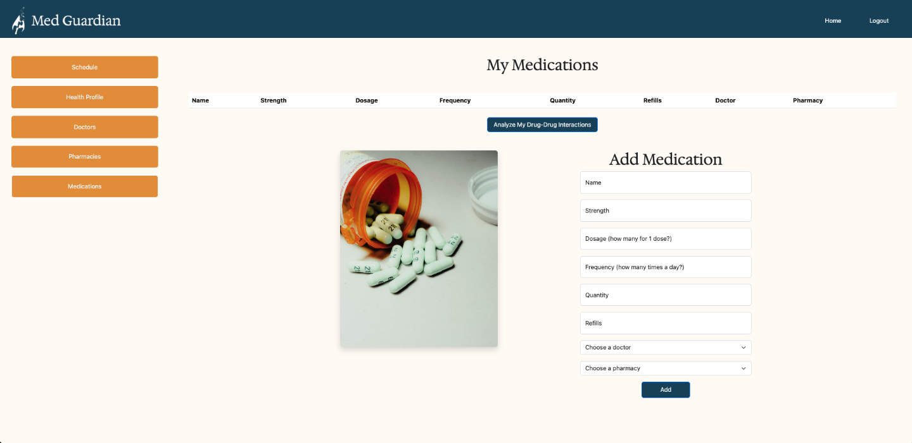

# PROJECT: Med Guardian

Project Med Guardian is an application that allows users to manage and track their medication schedules.

The project is a full stack FastAPI, PostgreSQL and React application that is built to run on Docker.

## Team:

- Onkur Lal
- Michael Zinzun
- Dennie Chan

## Technologies used for Med Guardian

- FastApi
- PostgreSQL
- Docker
- React
- Redux

## Screenshots

### Home Page

### Health Profile

### Doctors

### Pharmacies

### Medications

### Calendar and Schedules

### Design Color Palette

- Button Colors, Title Bar, (#164863)
- Borders for forms and tables (#427D9D)
- Active item (#9BBEC8)
- Alternate background for table (#DDF2FD)
- Background color (#FFFBF5)

## Project Planning and Organization

For our project we utilized an issue and ticket system within the repo to help plan, organize and coordinate our efforts to develop the application. We utilized the following strategy to optimize and guide our efforts:

1. We began our day discussing our plans, any blockers we faced in the previous day and then assigned ourselves to tickets.
2. Each time member worked on feature branches associated with their tickets.
3. Whenever a team member was completed with their ticket they would request a peer review of their work.
4. After tickets were reviewed then that team member would submit their work for a merge request.
5. Each merge request was reviewed by a fellow team member and absent any issues or conflict with tests or linted would be submitted.
6. Most feature branches would be deleted upon merge or kept if further development was warranted.

Note: Some tickets were particularly complicated and would have several team members working on them.

[Link to issues, Project Tracking and Development Board](https://gitlab.com/Onkurlal/module3-project-gamma/-/boards)

### Database Models Design

The diagram below showcases the various database models utilized in our project and their relationship to one another.

### Backend API Endpoints

Here are diagrams of the API endpoints serving our project:

**Medications API**

**Pharmacy API**

**Doctors API**

**User Account API**

**User Profile API**

### Steps to Run the Project

1. Fork the project located at [Module3 Project Gamma](https://gitlab.com/Onkurlal/module3-project-gamma)
2. Once the project is forked, close via git clone https link.
3. Once cloned, cd into app directory and run the following commands:
4. - Make sure you have Docker running
5. docker volume create postgres-data
6. docker volume create pg-admin
7. docker-compose build
8. docker-compose up
